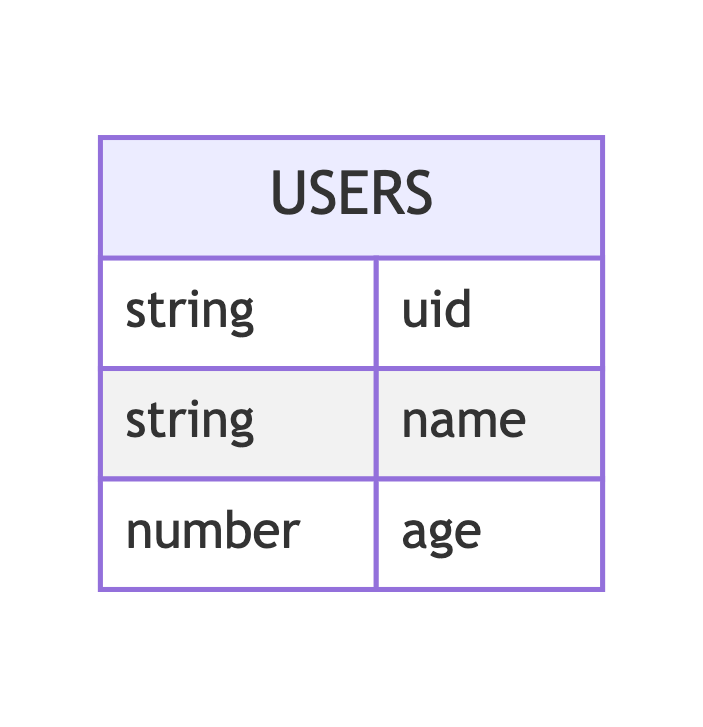

# simple-flask-api
a simple api using flask, provided 5 end points with RESTful design. 

## Installation
1. **Set up a virtual environment:**
    ```bash
    python3 -m venv venv  
    ```

2. **Activate the virtual environment:**
    - For macOS/Linux:
      ```bash
      source venv/bin/activate  
      ```
    - For Windows:
      ```bash
      venv\Scripts\activate  
      ```
3. **Install dependencies:**

    ```bash
    pip install -r requirements.txt 
    ```

## Running the Application
1. **Navigate to the /app directory:**
    ```bash
    cd app
    ```
2. **Run the Flask app:**
    ```bash
    python app.py
    ```

## API Endpoints
1. GET /user
2. POST /user/new
3. PUT /user/[uid]
4. GET /user/[uid]
5. DELETE /user/[uid]

# users entity


